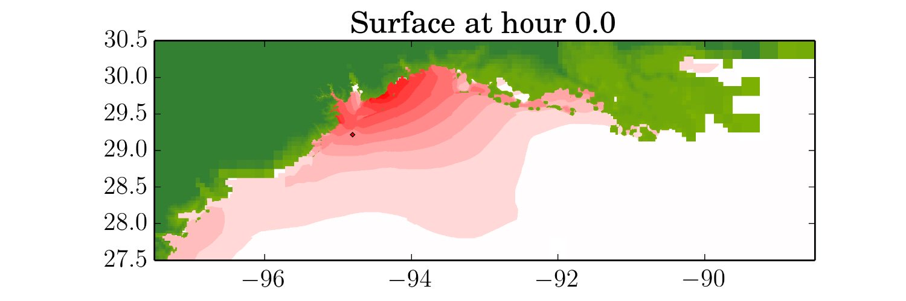

Welcome to Kyle's page.  This site is heavily under construction currently so please stay tuned for active updates.

### Bio

Kyle is currently a research scientist at the [Center for Computational Mathematics](https://www.simonsfoundation.org/flatiron/center-for-computational-mathematics/), a part of the [Flatiron Institute](https://www.simonsfoundation.org/flatiron) and an internal research division of the [Simons Foundation](https://www.simonsfoundation.org).  Previously, he was a faculty member in the department of [applied physics and applied mathematics](https://www.apam.columbia.edu) at Columbia University. Before that, he was a postdoc at the University of Texas at Austin in what is now the [Oden Institute](https://www.oden.utexas.edu). He received his Ph.D. in applied mathematics in 2011 from the [University of Washington](https://amath.washington.edu), studying multi-layered shallow flows. Kyle’s research interests involve the computational and analytical aspects of geophysical shallow mass flows such as storm-surge, tsunamis, and other coastal flooding. This also includes the development of advanced computational approaches, such as adaptive mesh refinement, leveraging novel computational technologies, such as accelerators, and the application of good software development practices as applied more generally to scientific and engineering software.

He has been an active member of the [Society for Industrial and Applied Mathematics (SIAM)](https://www.siam.org) and the [American Geophysical Union (AGU)](https://www.agu.org) organizing a number of symposia and workshops on the topics of high-performance computing and issues related to wave-propagation problems.  He is also one of the primary developers of the open-source package [ClawPack (Conservation Laws Package)](http://www.clawpack.org) as well as [GeoClaw](http://depts.washington.edu/clawpack/geoclaw/), a package for modeling shallow geophysical flows including storm surge, and [PyClaw](http://www.clawpack.org/pyclaw/), a high-performance library to do the same in Python.

Storm surge from Hurricane Ike.
